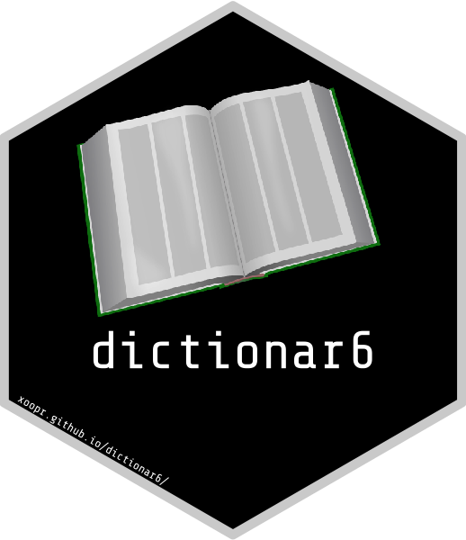

```{r setup, include=FALSE}
knitr::opts_chunk$set(echo = TRUE)
library(dictionar6)
ref <- function(val) sprintf("[%s](https://xoopr.github.io/dictionar6/reference/%s.html)",
                             as.character(substitute(val)),
                             as.character(substitute(val)))
cran <- function(val) sprintf("**[%s](https://CRAN.R-project.org/package=%s)**",
                              as.character(substitute(val)),
                              as.character(substitute(val)))
gh <- function(org, repo) sprintf("**[%s](https://github.com/%s/%s)**", repo, org, repo)
pkg <- function(pkg) sprintf("**%s**", as.character(substitute(pkg)))
d6 <- "**dictionar6**"
```



[](https://cran.r-project.org/package=dictionar6)
[](https://cran.r-project.org/web/checks/check_results_dictionar6.html)
[](https://github.com/xoopR/dictionar6/actions/workflows/check-covr.yml)

[](https://github.com/xoopR/dictionar6)
[](https://github.com/xoopR/dictionar6)

[](https://cran.r-project.org/package=dictionar6)
[](https://codecov.io/gh/xoopR/dictionar6)
[](https://CRAN.R-project.org/package=dictionar6)
[](https://opensource.org/licenses/MIT)

## What is dictionar6?

`r d6` is an R6 dictionary interface that makes use of symbolic representation to efficiently store R6 and non-R6 objects as symbols to prevent issues with cloning, large object sizes, or construction bottlenecks. The dictionary contains all 'usual' methods for getting and setting elements.

## Main Features

Some main features/key use-cases of `r d6` includes:

* Construction of untyped dictionaries

```{r construction untyped}
dct(a = 1, b = "2")
```

* Construction of typed dictionaries

```{r construction typed}
dct(a = 1L, b = 2L, c = 3L, types = "integer")
```

* Getting values

```{r get}
d <- dct(a = 1, b = 2)
d$has("a")
d$get("a")
d[c("a", "b")]
```

* Setting values

```{r set}
d <- dct(a = 1, b = 2)
d$rekey("a", "c")
d$keys
d$revalue("b", 3)
d$items
```

* Safe cloning of R6 objects

```{r R6, echo=FALSE}
RClass <- R6::R6Class("RClass",
  public = list(
    initialize = function(x) private$.x <- x,
    add = function(x) {
      private$.x <- c(private$.x, x)
      invisible(self)
    },
    values = function(x) unlist(private$.x)
  ),
  private = list(.x = list())
)
```

```{r store R6}
r <- RClass$new(1)
r$values()
d <- dct(a = r)
# default is to clone
d$get("a", clone = TRUE)$add(2)
# r is unaffected
r$values()

# if we don't clone...
d$get("a", clone = FALSE)$add(2)
# r is affected
r$values()
```

## Installation

For the latest release on [CRAN](https://CRAN.R-project.org/package=dictionar6), install with
```{r eval=FALSE}
install.packages("dictionar6")
```

Otherwise for the latest stable build
```{r eval=FALSE}
remotes::install_github("xoopR/dictionar6")
```

## Use-cases

`r d6` is currently used in `r cran(param6)` to provide a symbolic representation for R6 classes. This is incredibly useful to prevent storing unnecessarily large R6 objects. `r cran(param6)` comes pre-loaded with a `r ref("Dictionary")` of mathematical sets where the keys are symbolic representations of the sets and the values are the sets themselves, this allows users to refer to R6 objects with their character representation without having to continually construct new objects.

## Future Plans

The `r d6` API is still experimental and may be subject to major changes. Currently it's primary use-case is in `r cran(param6)`, minor or major changes will be made to satisfy this dependency. Future development will then focus on code quality and speed.

## Package Development and Contributing

`r d6` is released under the [MIT licence](https://opensource.org/licenses/MIT). We welcome and appreciate all [new issues](https://github.com/xoopR/dictionar6/issues) relating to bug reports, questions and suggestions. You can also [start a discussion](https://github.com/xoopR/dictionar6/discussions) for more extensive feedback or feature suggestion.
